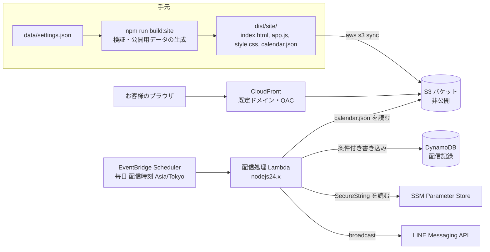

# 設計書：田中屋 営業日カレンダー

状態：確定（2026-10-05）

要件は `requirements.md`（確定版）。本書の「要件 x.y」はその番号を指す。

## 概要

運用者が手元の `data/settings.json` を書き換えてデプロイすると、次の2つが同じ公開用データ（`calendar.json`）から動く。

- 公開ページ：S3 と CloudFront で配信する静的ページ。ブラウザが日本時間の「今日」を計算して表示する
- 前日配信：EventBridge Scheduler が毎日 Lambda を起動し、翌日の案内を LINE で送る

判定のロジックは純粋関数にまとめ、ビルド時（公開用データの生成）、ブラウザ（今日の選択）、Lambda（案内の種類の決定）で同じコードを使う。営業曜日はコードに持たず、設定ファイルから読む（要件 1.5）。

### 設計上の判断

| 判断 | 理由 |
|---|---|
| 配信処理は、最後にデプロイした設定から作った S3 の `calendar.json` を読んで判定する。設定ファイルを Lambda に持たせない | 「最後にデプロイした設定で判定する」（要件 5.8）を、公開ページと同じデータで満たせる。休業日の変更が S3 への反映だけで済む |
| 公開用データは12か月分を作り、「今日」はブラウザで選ぶ | 再デプロイなしで日付や月が変わっても正しく表示する（要件 4.4） |
| 公開ページの URL は Lambda の環境変数で渡す | 公開用データに AWS のリソース名を入れない（要件 3.5）。初回デプロイ前に URL が決まらない問題も避ける |
| デプロイ用のまとめスクリプトを作らない。`sam deploy` と `aws s3 sync` は手順書のとおり直接実行する | `.kiro/harness/` の hook はコマンドの文字列で変更系を止める。スクリプト経由だと止まらない |
| スタックをテスト用と本番用の2つに分ける | テスト用アカウントのトークンで試験送信し、本番アカウントへの誤配信を防ぐ（要件 7.2） |
| 設定の検証は自前の関数で書く | 違反をすべて集めて表示する（要件 2.9）。Lambda とブラウザに依存を持ち込まない |
| 曜日は `sun`〜`sat` の名前で書く | 数字（0〜6）より読み違えにくい。設定ファイルは人が手で書き換える |

## アーキテクチャ



### デプロイの流れ

詳しい手順は `docs/runbooks/deploy.md` に書く。3〜5 は hook の対象で、手順書の読み取りと承認が要る。

1. `npm run build:site`：設定ファイルを検証し、`dist/site/` と `dist/deploy-parameters.txt`（配信時刻から作った cron 式）を作る。違反があれば何も書かずに終了コード1で止まる
2. `sam build`
3. `sam deploy --config-env <test|prod> --parameter-overrides ...`
4. `aws s3 sync dist/site s3://<バケット名> --delete`
5. `aws cloudfront create-invalidation --distribution-id <ID> --paths "/*"`

バケット名と配信の ID は、スタックの出力（`aws cloudformation describe-stacks`、読み取りのみ）から取る。営業曜日、休業日、臨時営業日、営業時間だけを変えるときは 1、4、5 で足りる。配信時刻を変えるときは 1〜5 のすべてを行う。

## コンポーネントとインターフェース

### `src/calendar/`：日付と判定（純粋関数）

```typescript
/** 日本時間の暦日。形式は YYYY-MM-DD */
type IsoDate = string & { readonly brand: "IsoDate" };

const WEEKDAYS = ["sun", "mon", "tue", "wed", "thu", "fri", "sat"] as const;
type Weekday = (typeof WEEKDAYS)[number];

type DayStatus = { open: boolean; exception: boolean };

type BusinessRules = {
  openWeekdays: ReadonlySet<Weekday>;
  closedDates: ReadonlySet<IsoDate>;
  specialOpenDates: ReadonlySet<IsoDate>;
};

/** 時刻を日本時間の日付にする。日本時間は夏時間がないため UTC+9 の固定で計算する */
const toJstDate = (instant: Date): IsoDate => { /* ... */ };
const addDays = (date: IsoDate, days: number): IsoDate => { /* Date.UTC で計算 */ };
const weekdayOf = (date: IsoDate): Weekday => { /* Date.UTC と getUTCDay で計算 */ };
const isIsoDate = (value: string): value is IsoDate => { /* 実在する日か */ };

/** 要件1。休業日 > 臨時営業日 > 営業曜日の順に見る。検証済みの設定では両方に入る日はない */
const judgeDay = (date: IsoDate, rules: BusinessRules): DayStatus => { /* ... */ };

/** 設定から判定用の規則を作る */
const toBusinessRules = (settings: Settings): BusinessRules => { /* ... */ };
```

実行環境のタイムゾーンを読む API（`getHours`、`getDay`、`toLocaleDateString` など）は使わない。

### `src/settings/`：設定ファイルの型と検証

```typescript
type HhMm = string & { readonly brand: "HhMm" };

type Settings = {
  openWeekdays: Weekday[];
  closedDates: IsoDate[];
  specialOpenDates: IsoDate[];
  businessHours: { open: HhMm; close: HhMm };
  notifyTime: HhMm;
};

type ValidationIssue = { path: string; message: string };

/** 要件2。違反をすべて集める。1つでもあれば ok: false */
const validateSettings = (raw: unknown):
  | { ok: true; settings: Settings }
  | { ok: false; issues: ValidationIssue[] } => { /* ... */ };
```

検証の規則（要件 2.3〜2.8）：

- 最上位の項目は5つだけ。ほかの項目があれば違反
- 営業曜日は `sun`〜`sat` の名前を重複なく1つ以上
- 日付は `YYYY-MM-DD` の実在する日。一覧の中の重複も違反
- 休業日は既定の営業日だけ。臨時営業日は既定の営業日以外だけ。両方に入る日は違反
- 時刻は `00:00`〜`23:59`。営業時間は開始 < 終了

営業曜日の検証が通らないときは、休業日と臨時営業日の曜日の検証を行わない（同じ原因の違反を重ねて出さないため）。

### `src/publish/`：公開用データと公開ページ

```typescript
type CalendarData = {
  version: 1;
  generatedAt: string; // ISO 8601（UTC）
  range: { from: IsoDate; to: IsoDate };
  businessHours: { open: HhMm; close: HhMm };
  days: Array<{ date: IsoDate } & DayStatus>;
};

/** 要件3。now の日本時間の月の1日から、11か月後の月末まで */
const buildCalendarData = (input: { settings: Settings; now: Date }): CalendarData => { /* ... */ };

/** 公開用データの形を確かめる。配信処理とブラウザが読むときに使う */
const parseCalendarData = (raw: unknown): CalendarData | null => { /* ... */ };

type TodayView =
  | { kind: "inRange"; date: IsoDate; open: boolean; exception: boolean; businessHours: CalendarData["businessHours"] }
  | { kind: "outOfRange" };

/** 要件4.2、4.4、4.5。閲覧時刻を日本時間にした日付を選ぶ */
const selectToday = (data: CalendarData, now: Date): TodayView => { /* ... */ };

/** 要件4.3。「今日」の月と翌月の日を、範囲内のものだけ返す */
const selectMonths = (data: CalendarData, now: Date): MonthView[] => { /* ... */ };
```

公開用データは営業曜日を持たない。各日の営業可否だけで表示と配信が決まる。

公開ページの部品：

- `public/index.html`、`public/style.css`：静的ファイル。`lang="ja"`
- `src/publish/page.ts`：ブラウザ用の入口。`calendar.json` を読み、`selectToday` と `selectMonths` の結果を DOM に描く。esbuild で `dist/site/app.js` にまとめる
- 文字は `textContent` で入れ、`innerHTML` を使わない
- 営業可否は「営業」「休業」「臨時営業」「臨時休業」の文字で示す。色は補助に使う（要件 4.7）
- カレンダーは `<table>`。`<caption>` に年月、曜日の見出しは `<th scope="col">`
- `calendar.json` を読めない、または `parseCalendarData` が通らないときは、範囲外と同じ案内を出す

### `scripts/build-site.ts`：ビルド

1. `data/settings.json` を読み、`validateSettings` で検証する。違反があれば全件を表示して終了コード1（要件 2.2、2.9）
2. `buildCalendarData({ settings, now: new Date() })` で `calendar.json` を作る
3. `public/` を複製し、`src/publish/page.ts` を esbuild でまとめる
4. `notifyTime` から `cron(<分> <時> * * ? *)` を作り、`dist/deploy-parameters.txt` に書く

### `src/notify/`：前日配信

```typescript
type NoticeKind = "regular" | "specialClosed" | "specialOpen";

type NotificationPlan =
  | { action: "send"; targetDate: IsoDate; kind: NoticeKind }
  | { action: "skip"; targetDate: IsoDate } // 既定の営業日でなく例外もない（要件 5.6）
  | { action: "outOfRange"; targetDate: IsoDate }; // 対象日が公開用データにない（エラー処理を参照）

/** 要件5.2〜5.6。対象日は toJstDate(now) の翌日 */
const planNotification = (data: CalendarData, now: Date): NotificationPlan => { /* ... */ };

/** 要件5.7 */
const buildMessage = (input: { targetDate: IsoDate; kind: NoticeKind; businessHours: CalendarData["businessHours"]; pageUrl: string }): string => { /* ... */ };
```

案内の種類は公開用データの対象日の値で決める。

| 対象日の値 | 案内 |
|---|---|
| 営業、例外でない | 通常営業（`regular`） |
| 休業、例外 | 臨時休業（`specialClosed`） |
| 営業、例外 | 臨時営業（`specialOpen`） |
| 休業、例外でない | 送らない |

文面の案（最終の文言は実装時に確認する）：

```
田中屋です。明日10月11日（日）は通常どおり営業します。
営業時間 11:00〜15:00
営業日カレンダー https://xxxx.cloudfront.net/
```

臨時休業は「明日10月18日（日）は臨時休業します。」、臨時営業は「明日10月21日（水）は臨時営業します。」に営業時間を続ける。曜日の表記は `weekdayOf` から作る。

配信処理の本体は、外部とのやりとりを引数で受け取る。

```typescript
type DeliveryRecordStore = {
  /** 同じ対象日の記録がないときだけ「送信中」で作る（要件 6.2） */
  tryCreate: (input: { targetDate: IsoDate; kind: NoticeKind; at: Date }) => Promise<"created" | "exists">;
  markSent: (targetDate: IsoDate, at: Date) => Promise<void>;
  markFailed: (targetDate: IsoDate, at: Date, errorCode: string) => Promise<void>;
};

type BroadcastResult = { ok: true } | { ok: false; errorCode: string }; // 例: "HTTP_429"、"TIMEOUT"

type NotifyDeps = {
  now: () => Date;
  loadCalendar: () => Promise<CalendarData>;
  records: DeliveryRecordStore;
  getToken: () => Promise<string>;
  broadcast: (token: string, text: string) => Promise<BroadcastResult>;
  pageUrl: string;
  log: Logger;
};

const runNotify = async (deps: NotifyDeps): Promise<NotifyOutcome> => { /* 下の手順 */ };
```

`runNotify` の手順：

1. `loadCalendar` で公開用データを読み、`planNotification` で計画を作る
2. `skip` なら記録して終わる。`outOfRange` ならエラーをログに残して終わる
3. `getToken` でトークンを読む（記録を作る前に読む。SSM の失敗で記録だけが残らないようにする）
4. `records.tryCreate`。`exists` なら送らずに終わる（要件 6.3）
5. `broadcast` で送る。成功なら `markSent`、失敗なら `markFailed` を呼び、例外を投げずに終わる（要件 6.4）

`handler.ts` は AWS SDK で実体を作って `runNotify` に渡すだけにする。

- `loadCalendar`：S3 の `calendar.json` を GetObject で読み、`parseCalendarData` で確かめる
- `getToken`：SSM の GetParameter（WithDecryption）。名前は環境変数 `LINE_TOKEN_PARAMETER_NAME`
- `broadcast`：`fetch` で `POST https://api.line.me/v2/bot/message/broadcast`。10秒で打ち切る。2xx なら成功、それ以外は `HTTP_<状態コード>`、打ち切りは `TIMEOUT`
- ログにはトークンと Authorization ヘッダーを出さない（要件 7.1）

## データモデル

### 設定ファイル `data/settings.json`

```json
{
  "openWeekdays": ["sun"],
  "closedDates": ["2026-10-18"],
  "specialOpenDates": ["2026-10-21"],
  "businessHours": { "open": "11:00", "close": "15:00" },
  "notifyTime": "18:00"
}
```

見本の `data/settings.example.json` も同じ形で、営業曜日を日曜だけとし、検証を通る値にする（要件 2.10）。

### 公開用データ `calendar.json`

```json
{
  "version": 1,
  "generatedAt": "2026-10-05T10:00:00.000Z",
  "range": { "from": "2026-10-01", "to": "2027-09-30" },
  "businessHours": { "open": "11:00", "close": "15:00" },
  "days": [
    { "date": "2026-10-01", "open": false, "exception": false },
    { "date": "2026-10-04", "open": true, "exception": false }
  ]
}
```

### 配信記録（DynamoDB、オンデマンド課金）

| 属性 | 型 | 内容 |
|---|---|---|
| `targetDate` | S（パーティションキー） | 対象日 |
| `status` | S | `sending` / `sent` / `failed` |
| `kind` | S | 案内の種類 |
| `createdAt` / `updatedAt` | S | ISO 8601 |
| `errorCode` | S（任意） | `HTTP_429`、`TIMEOUT` など。応答の本文とヘッダーは入れない |
| `expiresAt` | N（TTL） | 作成から400日後の UNIX 秒 |

`tryCreate` は `attribute_not_exists(targetDate)` の条件付き PutItem。条件の失敗を `exists` として返す。

## インフラ（`template.yaml`）

| リソース | 主な設定 |
|---|---|
| S3 バケット | パブリックアクセスをすべてブロック、SSE-S3。バケットポリシーで CloudFront（OAC）からの読み取りだけを許す |
| CloudFront | OAC、既定のルートオブジェクト `index.html`、HTTPS へのリダイレクト。応答ヘッダーポリシーで `Content-Security-Policy: default-src 'self'` などを付ける |
| DynamoDB テーブル | 上の配信記録。TTL は `expiresAt` |
| Lambda 関数 | `nodejs24.x`、esbuild でビルド（AWS SDK は外部扱い）、タイムアウト30秒。環境変数は `BUCKET_NAME`、`TABLE_NAME`、`LINE_TOKEN_PARAMETER_NAME`、`PAGE_URL`（CloudFront のドメインから作る） |
| 起動の設定 | SAM の `ScheduleV2`。`ScheduleExpression` はパラメータ、`ScheduleExpressionTimezone: Asia/Tokyo`、`State` は `NotifyEnabled` から決める |

IAM は最小限にする。

- Lambda：`s3:GetObject`（`calendar.json` だけ）、`dynamodb:PutItem` と `dynamodb:UpdateItem`（このテーブルだけ）、`ssm:GetParameter`（指定したパラメータだけ）と復号に要る権限

デプロイのパラメータ：

| パラメータ | 既定 | 内容 |
|---|---|---|
| `NotifyEnabled` | `false` | `true` のときだけ起動の設定を有効にする（要件 7.3） |
| `LineTokenParameterName` | なし | トークンを置いた SSM パラメータの名前（要件 7.2） |
| `NotifyScheduleExpression` | なし | `dist/deploy-parameters.txt` の cron 式 |

`samconfig.toml` に `test` と `prod` の設定を置く（スタック名とパラメータ名だけで、秘密情報は書かない）。SSM パラメータはスタックの外で手で作る。Webhook の受信口（API Gateway や関数 URL）は作らない（要件 7.4）。

## エラー処理

| 状況 | 振る舞い |
|---|---|
| 設定ファイルがない、または検証で違反がある | ビルドが違反をすべて表示し、終了コード1で止まる。成果物は書かない |
| 配信処理で `calendar.json` を読めない、または形が正しくない | エラーをログに残して例外を投げる。記録はまだ作っていないため、起動の再試行で同じ日に送っても1回以下に収まる |
| 対象日が公開用データにない（最後のデプロイから11か月を超えた場合） | 送らずにエラーをログに残す。記録は作らない |
| SSM からトークンを読めない | エラーをログに残して例外を投げる。記録はまだ作っていない |
| 配信記録がすでにある | 送らずに情報をログに残す |
| 送信 API が 2xx 以外を返す（月の通数の上限超過を含む） | 再送せず、記録を `failed` にする。例外は投げない（要件 6.4） |
| 送信がタイムアウトする | 再送せず `failed`（`TIMEOUT`）にする。届いている可能性があることをログに書く |
| 送信の後に `markSent` が失敗する、または関数が途中で止まる | 記録は `sending` のまま残り、その対象日には二度と送らない |
| 公開ページで `calendar.json` を読めない | 営業可否を出さず、公式LINEで確かめるよう案内する |

起動の再試行や Lambda の再実行が起きても、記録の条件付き書き込みで送信は1回以下になる。

## 正しさの性質

要件の P1〜P9 を、次の形でプロパティベーステストにする。テスト名に P の番号と要件の番号を入れる。

| No. | 形式 | テストファイル |
|---|---|---|
| P1 | 任意の有効な設定 s と、s の休業日 d について、`judgeDay(d, toBusinessRules(s)).open === false` | `src/calendar/judge.property.test.ts` |
| P2 | 任意の有効な設定 s と、s の臨時営業日 d について、`judgeDay(d, toBusinessRules(s)).open === true` | 同上 |
| P3 | 任意の営業曜日 W と日付 d について、例外が空なら `judgeDay(d, rules).open === W.has(weekdayOf(d))` | 同上 |
| P4 | 任意の有効な設定 s と、s に加えても有効な例外 e について、e を加えて削除した設定の判定は、範囲内のすべての日で s の判定と一致する | 同上 |
| P5 | 任意の公開用データ、時刻、回数 n（1〜10）について、`runNotify` を n 回（順番と並行の両方）実行したとき、`broadcast` の呼び出しは、計画が `send` なら1回、それ以外なら0回 | `src/notify/runNotify.property.test.ts` |
| P6 | 任意の時刻 t について、`planNotification(data, t).targetDate === addDays(toJstDate(t), 1)`。さらに `toJstDate(t)` は `t + 9時間` の UTC の日付と一致する | `src/notify/plan.property.test.ts` |
| P7 | 任意の有効な設定 s と時刻 t について、`buildCalendarData({ settings: s, now: t })` の各日の値は `judgeDay` の結果と一致し、日付は範囲の初日から最終日まで欠けも重複もない | `src/publish/buildCalendarData.property.test.ts` |
| P8 | 任意の公開用データと、その範囲内の閲覧時刻 t について、`selectToday(data, t)` は `toJstDate(t)` の日の値を返す。範囲外の t では `outOfRange` を返す | `src/publish/selectToday.property.test.ts` |
| P9 | 規則を満たすように作った任意の設定を `validateSettings` が受け入れ、そこに不正な営業曜日（空、重複、未知の名前）、両方の一覧に入る日、効果のない例外のいずれかを1つ混ぜた設定を拒否する | `src/settings/validate.property.test.ts` |

生成器：

- 日付は 2024-01-01〜2030-12-31。月末、年末、2月29日を多めに出す
- 時刻は上の範囲の任意のミリ秒。UTC の 14:59〜15:01（日本時間の0時前後）を多めに出す
- 営業曜日は、7つの曜日の空でない任意の部分集合。日曜だけの組を多めに出す
- 有効な設定は、営業曜日に当たる日から休業日を、当たらない日から臨時営業日を選んで作る。営業時間は開始 < 終了になる組を作る
- P5 の記録は、`Map` で条件付き書き込みを再現した偽物を使う

## テスト方針

- Vitest と fast-check。`npx vitest run` で単体テストとプロパティベーステストをまとめて実行する
- 単体テスト
  - `validateSettings`：規則ごとの違反と、違反をすべて返すこと
  - `buildMessage`：3種類の文面、曜日の表記、営業時間の有無
  - `broadcast`：`fetch` を偽物にして、2xx、429、500、タイムアウトを確かめる。本物の LINE には送らない
  - `runNotify`：SSM の失敗、記録の重複、送信の失敗、`markSent` の失敗
  - `scripts/build-site.ts`：見本の設定でビルドが通り、壊れた設定で終了コード1になる
- AWS SDK を使う薄い実装（`handler.ts` の中身）は単体テストを書かず、テスト用スタックでの試験送信で確かめる

## ディレクトリ構成

```
src/
  calendar/   date.ts, judge.ts（とテスト）
  settings/   validate.ts（とテスト）
  publish/    buildCalendarData.ts, selectToday.ts, page.ts（とテスト）
  notify/     plan.ts, message.ts, runNotify.ts, lineClient.ts, deliveryStore.ts, handler.ts（とテスト）
scripts/      build-site.ts
public/       index.html, style.css
data/         settings.example.json（settings.json は git で管理しない）
docs/runbooks/ deploy.md
template.yaml, samconfig.toml
dist/         ビルドの成果物（git で管理しない）
```

`.kiro/steering/structure.md` には `scripts/`、`samconfig.toml`、`dist/` を足す。
