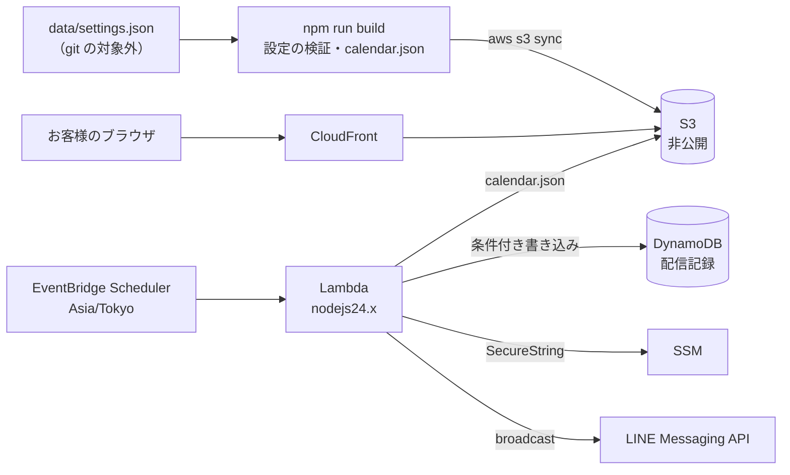

# 田中屋 営業日カレンダー（tanakaya-open-days）

ヴィーガンラーメン店「田中屋」の営業日を1つの設定ファイルで管理し、公開ページと LINE の前日配信に自動で反映するアプリです。Kiro University Challenge の最終課題として、Kiro の Spec 駆動開発で作りました。

公開ページ（テスト用スタック）：https://d2kzlmhcsl06b3.cloudfront.net/
（休業日・臨時営業日・営業時間は見本の値です。テスト用スタックは LINE の前日配信を無効にしています）

> **English summary** — A business-day calendar for a vegan ramen shop. One settings file drives a static public page (S3 + CloudFront) and a next-day LINE notice (EventBridge Scheduler + Lambda + DynamoDB). Built with Kiro: spec-driven development, steering, hooks, property-based tests, Powers (AWS SAM), MCP (LINE Bot MCP Server), custom agents, and a self-made Power. See the lesson table below.

## できること

- 営業日の判定：既定の営業曜日（田中屋は日曜）と、休業日・臨時営業日の例外で判定する。曜日はコードに固定せず、設定ファイルの値を使う
- 公開ページ：今日の営業可否と営業時間、今月と来月のカレンダー、公式 LINE と Instagram へのリンク。日付が変わっても、デプロイし直さずに「今日」が切り替わる
- LINE の前日配信：毎日決まった時刻に、翌日が営業日か例外の日なら、友だち全員に案内を送る。同じ日には1回しか送らない

## 構成



公開ページと前日配信は、同じ `calendar.json` で営業可否を決めます。休業日を変えるときは、設定ファイルを書き換えて S3 に反映するだけです（提出後のコミット禁止期間にも、git を使わずに更新できます）。

## Kiro のレッスンとの対応

| レッスン | 実演したこと | 該当するファイル |
|---|---|---|
| 1 Spec 駆動開発 | 計画（`docs/plan.md`）から requirements → design → tasks を作り、tasks の順に実装した。受け入れ基準は EARS 形式で48件、正しさの性質は P1〜P9 | [`.kiro/specs/open-days/`](.kiro/specs/open-days/) |
| 2 Steering | 営業ルールと用語、技術方針、テスト方針、LINE 配信の安全ルール、承認の扱いを常に読み込ませた | [`.kiro/steering/`](.kiro/steering/)（`product.md`、`tech.md`、`testing.md`、`line-messaging.md`、`start-approval.md` ほか） |
| 3 Hooks | `src/` の保存時にテストを実行し、requirements の保存時に design と tasks への影響を確かめさせる。あわせて、クラウドの変更、`.kiro/` の書き換え、LINE の一斉送信を承認なしでは実行させない hook を作った | [`.kiro/hooks/`](.kiro/hooks/)、[`.kiro/harness/`](.kiro/harness/) |
| 4 プロパティベーステスト | requirements の P1〜P9 を fast-check で検証した。日付は月末、年末、2月29日、日本時間の0時前後を多めに生成する | `src/**/*.property.test.ts`、[`src/testing/arbitraries.ts`](src/testing/arbitraries.ts) |
| 5 Powers | AWS SAM の Power を導入し、テスト用スタックのデプロイに使った（`sam_deploy`）。テンプレートの検証には AWS Infrastructure as Code の Power も使った | [`template.yaml`](template.yaml)、[`samconfig.toml`](samconfig.toml)、[`docs/runbooks/deploy.md`](docs/runbooks/deploy.md) |
| 6 MCP | LINE Bot MCP Server を接続し、依頼者宛ての push だけで試験送信する。トークンは起動時に SSM から読み、ファイルに書かない | [`.kiro/agents/line-tester.md`](.kiro/agents/line-tester.md) |
| 7 カスタムエージェント | LINE の試験送信だけを行う `line-tester`、仕様準拠を確かめる `spec-checker`、`security-auditor`、`unit-tester` を作り、使えるツールを分けた | [`.kiro/agents/`](.kiro/agents/) |
| ボーナス1 | Kiro Web のクラウドセッションで、tasks の 4.4（案内の文面）を実装する | [`src/notify/message.ts`](src/notify/message.ts)、tasks の 4.4 |
| ボーナス2 | LINE の告知を安全に扱う Power を自作した（Agent Plugins 形式） | [`powers/line-announce/`](powers/line-announce/) |

### 正しさの性質（プロパティベーステスト）

| No. | 性質 | テスト |
|---|---|---|
| P1 | 休業日に登録した日は、どの設定でも休業 | `src/calendar/judge.property.test.ts` |
| P2 | 臨時営業日に登録した日は、どの設定でも営業 | 同上 |
| P3 | 例外がない日は、営業曜日のときだけ営業 | 同上 |
| P4 | 例外を1つ加えて削除すると、すべての日の判定が元に戻る | 同上 |
| P5 | 同じ対象日に何回実行しても（並行実行を含む）、送信は1回以下 | `src/notify/runNotify.property.test.ts` |
| P6 | 対象日は、実行時刻を日本時間にした日付の翌日 | `src/notify/plan.property.test.ts` |
| P7 | 公開用データの各日は、判定機能の結果と一致する | `src/publish/buildCalendarData.property.test.ts` |
| P8 | 公開ページの「今日」は、閲覧時刻を日本時間にした日付の判定と一致する | `src/publish/selectToday.property.test.ts` |
| P9 | 設定の検証は、正しい設定をすべて受け入れ、矛盾する設定をすべて拒否する | `src/settings/validate.property.test.ts` |

テストが誤りを見逃さないか、わざとコードを壊して確かめました（休業日を無視する、営業曜日を日曜に固定する、日本時間を UTC+8 にする、記録があっても送る、など16種類）。

## 安全のための仕組み

LINE の配信は取り消せず、公式アカウントの友だちは実際のお客様です。エージェントが誤って配信やデプロイをしないよう、hook で機械的に止めています。

| 止める操作 | 通す条件 |
|---|---|
| `sam deploy`、`aws s3 sync` などのクラウドの変更、Power の `sam_deploy` | 手順書を読み、依頼者が承認の行を書いたとき |
| `.kiro/` 配下の書き換え（`.kiro/specs/` を除く） | 依頼者が承認の行を書いたとき |
| LINE Bot MCP Server の broadcast 系のツール、宛先を指定した push | 通さない |
| `sam local invoke` など、配信の関数を手で動かす操作 | 手順書を読み、依頼者が承認の行を書いたとき |

hook の本体は `.kiro/harness/` にあり、合成の入力で152件のテストを持ちます（`bash .kiro/harness/tests/run.sh`）。[mamezou/mamezou-claude-plugins](https://github.com/mamezou/mamezou-claude-plugins) の harness-ja（MIT）を Kiro 向けに移植したものです。

## 使い方

### 必要なもの

- Node.js 24、npm
- AWS SAM CLI、AWS CLI（プロファイル `mamelabo`）
- 前日配信を使う場合：LINE 公式アカウントのチャネルアクセストークンを SSM の SecureString に登録する

### テストとビルド

```bash
npm ci
npm test                      # 単体テストとプロパティベーステスト
npm run typecheck && npm run lint
cp data/settings.example.json data/settings.json   # 初回だけ。git の対象外
npm run build                 # 設定の検証、公開ページ、Lambda
```

### 設定ファイル

```json
{
  "openWeekdays": ["sun"],
  "closedDates": ["2026-10-18"],
  "specialOpenDates": ["2026-10-21"],
  "businessHours": { "open": "11:00", "close": "15:00" },
  "notifyTime": "18:00"
}
```

休業日は営業曜日の日だけ、臨時営業日は営業曜日以外の日だけに登録できます。メモなどほかの項目を足すと、ビルドが止まります。

### デプロイ

手順は [`docs/runbooks/deploy.md`](docs/runbooks/deploy.md) にあります。テスト用スタックは前日配信を無効のまま使います。

### AWS SAM の Power の導入

1. Kiro の Powers パネルで「AWS SAM」をインストールする
2. Power の MCP サーバー（`awslabs.aws-serverless-mcp-server`）の起動に、`--with botocore[crt]` と、環境変数 `AWS_PROFILE`、`AWS_REGION` を足す（`aws sso login` のログイン情報を使うため）
3. `--allow-write` は、デプロイの直前に足す。それまでは読み取り専用で使う

## ディレクトリ

```
src/calendar/   日付、営業日の判定、表記
src/settings/   設定ファイルの検証
src/publish/    公開用データ、公開ページ
src/notify/     前日配信（計画、送信、配信記録、Lambda の入口）
src/testing/    テスト用の生成器と偽物
scripts/        ビルド
public/         公開ページの HTML と CSS
powers/         自作の Power
docs/           計画と手順書
.kiro/          Spec、steering、hooks、エージェント、harness
```
